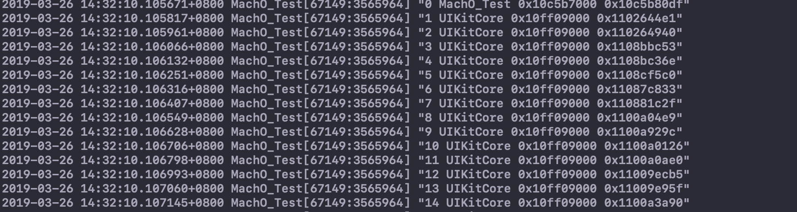

##### 工程里是利用machO格式后写的一段补抓堆栈符号的代码，backtrace_symbols这个函数在频繁使用的场景下是很消耗性能的，所以有必要将backtrace补抓到的stack address记录下来，并记录该image的load address利用

```c
//    atos -o [dsym file path] -l [Load Address] -arch [arch type] [Stack Address]
```

##### 来进行解析，实际应用的话，是在内存监测里，只记录堆栈符号，写脚本转换为具体的方法调用栈。




#### Mach-O格式


>mach64 Header				文件头 
>
>Load Commands				加载命令
>
>__TEXT						文本段（代码段，只读）
>
>__DATA						数据段（全局变量、堆栈数据）
>
>Dynamic Loader Info			动态库加载信息
>
>Function Starts				入口函数
>
>Symbol Table				符号表
>
>Dynamic Symbol Table		动态库符号表
>
>String Table					字符串表

### Header的结构体：

```c
struct mach_header {
  uint32_t    magic;		 
    /*魔数，系统加载器通过这个字段判断该文件是用于32位or64位  
         //32位魔数
         #define MH_MAGIC    0xfeedface  
         #define MH_CIGAM    0xcefaedfe  

         //64位魔数
         #define MH_MAGIC_64 0xfeedfacf 
         #define MH_CIGAM_64 0xcffaedfe 
    */
    
  cpu_type_t  cputype;
    /*CPU类型以及子类型字段，该字段确保系统可以将适合的二进制文件在当前架构下运行
        #define CPU_TYPE_ARM     ((cpu_type_t) 12)
        #define CPU_TYPE_ARM64   (CPU_TYPE_ARM | CPU_ARCH_ABI64)
    */
    
  cpu_subtype_t   cpusubtype; 
    /*CPU指定子类型，对于inter，arm，powerpc等CPU架构，其都有各个阶段和等级的CPU芯片，该字段就是详细描		述其支持CPU子类型。
    
        #define CPU_SUBTYPE_ARM_V7       ((cpu_subtype_t) 9)
    	#define CPU_SUBTYPE_ARM64_ALL    ((cpu_subtype_t) 0)
    	#define CPU_SUBTYPE_ARM64_V8     ((cpu_subtype_t) 1)
    */
    
  uint32_t    filetype;   
    /*说明该mach-o文件类型（可执行文件，库文件，核心转储文件，内核扩展，DYSM文件，动态库等）
    	#define  MH_OBJECT   0x1     //.o目录文件
        #define  MH_EXECUTE  0x2     //a.out可主动执行文件
        #define  MH_DYLIB    0x6     //.dylib文件
        #define  MH_DSYM     0xa     //.dSYM文件   
        #define  MH_KEXT_BUNDLE  0xb //.kext驱动文件    
    */
    
  uint32_t    ncmds;     
    /*加载command条数*/
    
  uint32_t    sizeofcmds; 
    /*表示加载命令大小*/
    
  uint32_t    flags;   
    /*标志位，该字段用位表示二进制文件支持的功能，主要是和系统加载，链接相关
        #define    MH_NOUNDEFS    0x1        // 目前没有未定义的符号，不存在链接依赖
        #define    MH_DYLDLINK    0x4        // 该文件是dyld的输入文件，无法被再次静态链接
        #define    MH_PIE 0x200000          // 加载程序在随机的地址空间，只在 MH_EXECUTE中使用
        #define    MH_TWOLEVEL    0x80      // 两级名称空间
    */
  };

  struct mach_header_64 {
      uint32_t    magic;             
      cpu_type_t  cputype;           
      cpu_subtype_t   cpusubtype;    
      uint32_t    filetype;          
      uint32_t    ncmds;             
      uint32_t    sizeofcmds;       
      uint32_t    flags;            
      uint32_t    reserved;          
  };

/*
ASLR 随机地址空间
进程每一次启动，地址空间都会简单地随机化。
如果采用传统的方式，程序的每一次启动的虚拟内存镜像都是一致的，黑客很容易采取重写内存的方式来破解程序。采用ASLR-地址空间配置随机加载（Address space layout randomization）将可执行程序随机装载到内存里，可以有效的避免缓冲区溢出攻击。


dyld(/usr/lib/dyld)
动态链接器：当内核执行LC_DYLINK时，链接器会启动，查找进程所依赖的动态库，并加载到内存中。


二级名称空间
这是dyld的一个独有特性，符号空间中还包括所在库的信息，这样子就可以让两个不同的库导出相同的符号。
*/
```

### command格式：

```c
/*
Mach-O文件包含非常详细的加载指令，这些指令非常清晰地指示加载器如何设置并且加载二进制数据。Load Commands信息紧紧跟着二进制文件头后面。加载命令的数目以及总的大小在header中已经给出。
*/

struct load_command {
    uint32_t cmd;        /* type of load command */
    uint32_t cmdsize;    /* total size of command in bytes */
};

/*
CMD字段的解释

LC_SEGMENT_64			将文件中（32位或64位）的段映射到进程地址空间中。
LC_SYMTAB				符号表地址。
LC_DYSYMTAB				动态符号表地址
LC_DYLD_INFO_ONLY		动态链接相关信息
LC_LOAD_DYLINKER		加载一个动态链接器（动态库加载器），通常路径是“/usr/lib/dyld”。
LC_LOAD_DYLIB:			加载一个动态链接共享库。如“/usr/lib/libSystem.B.dylib”，这是C标准库。每个							库由动态链接器加载并包含一个符号表。

LC_UUID					文件的唯一标识，crash解析中也会有该值，去确定dysm文件和crash文件是匹配的。
LC_VERSION_MIN_MACOSX	二进制文件要求的最低操作系统版本
LC_MAIN					设置程序主线程的入口地址和栈大小
LC_SOURCE_VERSION		构建该二进制文件使用的源代码版本
LC_FUNCTION_STARTS		定义一个函数起始地址表，使调试器和其他程序易于看到一个地址是否在函数内
LC_DATA_IN_CODE			定义在代码段内的非指令数据


LC_SEGMENT_64和LC_SEGMENT是加载的主要命令，它负责指导内核来设置进程的内存空间
*/
```

### segment的结构：

```c
struct segment_command { /* for 32-bit architectures */
    uint32_t    cmd;        /* LC_SEGMENT */
    uint32_t    cmdsize;    /* includes sizeof section structs */
    char        segname[16];    /* segment name */
    uint32_t    vmaddr;     /* memory address of this segment */
    uint32_t    vmsize;     /* memory size of this segment */
    uint32_t    fileoff;    /* file offset of this segment */
    uint32_t    filesize;   /* amount to map from the file */
    vm_prot_t   maxprot;    /* maximum VM protection */
    vm_prot_t   initprot;   /* initial VM protection */
    uint32_t    nsects;     /* number of sections in segment */
    uint32_t    flags;      /* flags */
};

struct segment_command_64 { /* for 64-bit architectures */
    uint32_t    cmd;        /* LC_SEGMENT_64 */
    uint32_t    cmdsize;    /* includes sizeof section_64 structs */
    char        segname[16];    /* segment name */
    uint64_t    vmaddr;     /* memory address of this segment */
    uint64_t    vmsize;     /* memory size of this segment */
    uint64_t    fileoff;    /* file offset of this segment */
    uint64_t    filesize;   /* amount to map from the file */
    vm_prot_t   maxprot;    /* maximum VM protection */
    vm_prot_t   initprot;   /* initial VM protection */
    uint32_t    nsects;     /* number of sections in segment */
    uint32_t    flags;      /* flags */
};
/*
- cmd
  就是Load commands的类型，这里LC_SEGMENT_64代表将文件中64位的段映射到进程的地址空间。LC_SEGMENT_64和LC_SEGMENT的结构差别不大。

- cmdsize
  代表load command的大小

- segname 
  16字节的段名字

- vmaddr 
  段的虚拟内存起始地址

- vmsize 
  段的虚拟内存大小

- fileoff 
  段在文件中的偏移量

- filesize 
  段在文件中的大小

- maxprot 
   段页面所需要的最高内存保护（1=r,2=w,4=x）

- initprot 
  段页面初始的内存保护

- nsects 
  段中包含section的数量

- flags 
  其他杂项标志位
  */
```

### 段（segment）和节(section)

>__Text代表的是Segment
>
>__text代表的是Section
>
>__PAGEZERO：一个全用0填充的段，用于抓取空指针引用(非法内存访问)。这通常不会占用物理内存空间。
>
>__TEXT：本段只有可执行代码和其他只读数据。

```asm
__text           主程序代码  

__stubs         用于动态库链接的桩   

__stub_helper   用于动态库链接的桩的辅助    

__cstring       常量字符串符号表描述信息，通过该区信息，可以获得常量字符串符号表地址  
    
__unwind_info  存储堆栈展开信息供处理异常。

 __eh_frame：  提供堆栈展开信息,用于异常处理
 
➜ otool -tv a.out 
a.out:
(__TEXT,__text) section
_main:
0000000100000f30    pushq   %rbp
0000000100000f31    movq    %rsp, %rbp
0000000100000f34    subq    $0x20, %rsp
0000000100000f38    leaq    0x47(%rip), %rax
0000000100000f3f    movl    $0x0, -0x4(%rbp)
0000000100000f46    movl    %edi, -0x8(%rbp)
0000000100000f49    movq    %rsi, -0x10(%rbp)
0000000100000f4d    movq    %rax, %rdi
0000000100000f50    movb    $0x0, %al
0000000100000f52    callq   0x100000f64
0000000100000f57    xorl    %ecx, %ecx
0000000100000f59    movl    %eax, -0x14(%rbp)
0000000100000f5c    movl    %ecx, %eax
0000000100000f5e    addq    $0x20, %rsp
0000000100000f62    popq    %rbp
0000000100000f63    retq
```

>__DATA：用于读取和写入数据的一个段，有两个指针域：
>
>__nl_symbol_ptr：非延迟导入符号指针表
>
>__la_symbol_ptr：延迟导入符号指针表

>__LINKEDIT：
>
>包含给动态链接器的原始数据的段，包括符号和字符串表，压缩动态链接信息，以及动态符号表等。


### Section的数据结构

```c
struct section { /* for 32-bit architectures */
        char        sectname[16];   /* name of this section */
        char        segname[16];    /* segment this section goes in */
        uint32_t    addr;       /* memory address of this section */
        uint32_t    size;       /* size in bytes of this section */
        uint32_t    offset;     /* file offset of this section */
        uint32_t    align;      /* section alignment (power of 2) */
        uint32_t    reloff;     /* file offset of relocation entries */
        uint32_t    nreloc;     /* number of relocation entries */
        uint32_t    flags;      /* flags (section type and attributes)*/
        uint32_t    reserved1;  /* reserved (for offset or index) */
        uint32_t    reserved2;  /* reserved (for count or sizeof) */
    };

    struct section_64 { /* for 64-bit architectures */
        char        sectname[16];   /* name of this section */
        char        segname[16];    /* segment this section goes in */
        uint64_t    addr;       /* memory address of this section */
        uint64_t    size;       /* size in bytes of this section */
        uint32_t    offset;     /* file offset of this section */
        uint32_t    align;      /* section alignment (power of 2) */
        uint32_t    reloff;     /* file offset of relocation entries */
        uint32_t    nreloc;     /* number of relocation entries */
        uint32_t    flags;      /* flags (section type and attributes)*/
        uint32_t    reserved1;  /* reserved (for offset or index) */
        uint32_t    reserved2;  /* reserved (for count or sizeof) */
        uint32_t    reserved3;  /* reserved */
    };
    
    /*
    sectname：比如__text、__stubs

    segname ：该section所属的segment，比如__TEXT
    
    addr ： 该section在内存的起始位置
    
    size： 该section的大小
    
    offset： 该section的文件偏移
    
    align ： 字节大小对齐（以多少字节对齐，一般是2的乘幂）
    
    reloff ：重定位入口的文件偏移
    
    nreloc： 需要重定位的入口数量
    
    flags：包含section的type和attributes
   
    reserved: 预留的字段
    */
```


### 动态库链接信息

>LC_DYLD_INFO_ONLY：
>
>根据该加载命令的字段偏移，可以得到压缩动态数据信息区(动态库绑定，地址重定向等信息）

```c
struct dyld_info_command {
 uint32_t   cmd;      /* LC_DYLD_INFO or LC_DYLD_INFO_ONLY */
 uint32_t   cmdsize;      /* sizeof(struct dyld_info_command) */
 uint32_t   rebase_off;   /* file offset to rebase info  */
 uint32_t   rebase_size;  /* size of rebase info   */
 uint32_t   bind_off; /* file offset to binding info   */
 uint32_t   bind_size;    /* size of binding info  */      
 uint32_t   weak_bind_off;    /* file offset to weak binding info   */
 uint32_t   weak_bind_size;  /* size of weak binding info  */
 uint32_t   lazy_bind_off;    /* file offset to lazy binding info */
 uint32_t   lazy_bind_size;  /* size of lazy binding infs */ 
 uint32_t   export_off;   /* file offset to lazy binding info */
 uint32_t   export_size;  /* size of lazy binding infs */
};

/*
 重定向数据rebase(命令码：高四位 低四位)
 11:  高四位0x10 表示设置立即数类型   低四位0x01 表示立即数类型为指针
 22:  表示REBAE_OPCODE_SET_SEGMENT_AND_OFFSET_ULEB + 2 重定向到数据段第2个section     
 意思就是：重定向到数据段第二个section，该数据段信息为一个指针。
 e.g: 在demo中是[0x100001010->_printf]

绑定数据 bind:
进行动态绑定依赖的dyld的函数（dyld_stub_binder）

弱绑定数据 weak bind：
用于弱绑定动态库，就像weak_framework一样

延时绑定数据 lazy bind：
对于需要从动态库加载的函数符号(_printf)

export数据：
用于对外开放的函数（_add、_main）

➜nm a.out       
  0000000100000000 T __mh_execute_header
  0000000100000f00 T _add
  0000000100000f20 T _main
                   U _printf
                   U dyld_stub_binder
                   
                   
__stubs区和__stub_helper区是帮助动态链接器找到指定数据段__nl_symbol_ptr区，二进制文件用0x0000000000000000进行占位，在运行时，系统根据dynamic loader info信息，把占位符换为调用dylib的dyld_stub_binder函数的汇编指令。     

当第一次调用完动态库中的符号后，动态链接器会根据dynamic loader info信息，把__la_symbol_ptr区中的数据指向正确的符号地址，而不是指向_nl_symbol_ptr区。
*/
```

### fishhook工作原理：

```c
int rebind_symbols(struct rebinding rebindings[], size_t rebindings_nel) {
  //在钩子链表头增加新的钩子
  int retval = prepend_rebindings(&_rebindings_head, rebindings, rebindings_nel);
  if (retval < 0) {
    return retval;
  }
  if (!_rebindings_head->next) { //首次调用
    //注册系统回调
    _dyld_register_func_for_add_image(_rebind_symbols_for_image);
  } else {
    uint32_t c = _dyld_image_count();
    for (uint32_t i = 0; i < c; i++) {
      _rebind_symbols_for_image(_dyld_get_image_header(i), _dyld_get_image_vmaddr_slide(i));
    }
  }
  return retval;
}


//回调函数（参数1：mach_header的地址，参数2:slide 随机偏移量）
//由于ASLR的缘故，导致程序实际虚拟内存地址与对应的Mach-o结构中的地址不一致，有一个偏移量
//slide，slide是程序装在时随机生成的随机数。
static void _rebind_symbols_for_image(const struct mach_header *header,
                                      intptr_t slide) {                            
    rebind_symbols_for_image(_rebindings_head, header, slide);
}


static void rebind_symbols_for_image(struct rebindings_entry *rebindings,
                                     const struct mach_header *header,
                                     intptr_t slide) {
  Dl_info info;
  if (dladdr(header, &info) == 0) {
    return;
  }

  segment_command_t *cur_seg_cmd;
  segment_command_t *linkedit_segment = NULL;
  struct symtab_command* symtab_cmd = NULL;
  struct dysymtab_command* dysymtab_cmd = NULL;

  //计算load commands区域的位置（紧跟mach_header之后）
  uintptr_t cur = (uintptr_t)header + sizeof(mach_header_t);
  
  //遍历加载指令区域
  for (uint i = 0; i < header->ncmds; i++, cur += cur_seg_cmd->cmdsize) {
    cur_seg_cmd = (segment_command_t *)cur;
    //LC_SEGMENT指令
    if (cur_seg_cmd->cmd == LC_SEGMENT_ARCH_DEPENDENT) {  
      //__LINKEDIT段
      if (strcmp(cur_seg_cmd->segname, SEG_LINKEDIT) == 0) {
        linkedit_segment = cur_seg_cmd;
      }
    } else if (cur_seg_cmd->cmd == LC_SYMTAB) { //符号表
      symtab_cmd = (struct symtab_command*)cur_seg_cmd;
    } else if (cur_seg_cmd->cmd == LC_DYSYMTAB) {//动态符号表
      dysymtab_cmd = (struct dysymtab_command*)cur_seg_cmd;
    }
  }

  if (!symtab_cmd || !dysymtab_cmd || !linkedit_segment ||
      !dysymtab_cmd->nindirectsyms) {
    return;
  }

  //计算mach-o header在内存空间中的位置
  uintptr_t linkedit_base = (uintptr_t)slide + linkedit_segment->vmaddr - linkedit_segment->fileoff;
  
  //计算Symbol Table的位置
  nlist_t *symtab = (nlist_t *)(linkedit_base + symtab_cmd->symoff);
  
  //计算String Table的位置
  char *strtab = (char *)(linkedit_base + symtab_cmd->stroff);

  //计算Dynamic Symbol Table的位置 
  uint32_t *indirect_symtab = (uint32_t *)(linkedit_base + dysymtab_cmd->indirectsymoff);

  //计算load commands区域的位置（紧跟mach_header之后）
  cur = (uintptr_t)header + sizeof(mach_header_t);
  for (uint i = 0; i < header->ncmds; i++, cur += cur_seg_cmd->cmdsize) {//遍历
    cur_seg_cmd = (segment_command_t *)cur;
    //LC_SEGMENT
    if (cur_seg_cmd->cmd == LC_SEGMENT_ARCH_DEPENDENT) {
      //数据段（__DATA）
      if (strcmp(cur_seg_cmd->segname, SEG_DATA) != 0 &&
          strcmp(cur_seg_cmd->segname, SEG_DATA_CONST) != 0) {
        continue;
      }
      for (uint j = 0; j < cur_seg_cmd->nsects; j++) {
        section_t *sect =
          (section_t *)(cur + sizeof(segment_command_t)) + j;
          //__la_symbol_ptr区
        if ((sect->flags & SECTION_TYPE) == S_LAZY_SYMBOL_POINTERS) {
          perform_rebinding_with_section(rebindings, sect, slide, symtab, strtab, indirect_symtab);
        }
        //__nl_symbol_ptr区
        if ((sect->flags & SECTION_TYPE) == S_NON_LAZY_SYMBOL_POINTERS) {
          perform_rebinding_with_section(rebindings, sect, slide, symtab, strtab, indirect_symtab);
        }
      }
    }
  }
}


static void perform_rebinding_with_section(struct rebindings_entry *rebindings,
                                           section_t *section,
                                           intptr_t slide,
                                           nlist_t *symtab,
                                           char *strtab,
                                           uint32_t *indirect_symtab) {
  //计算（延时/非延时）加载区在indirect symtab表中的位置                                         
  uint32_t *indirect_symbol_indices = indirect_symtab + section->reserved1;
  
  //计算（延时/非延时）加载区的地址
  void **indirect_symbol_bindings = (void **)((uintptr_t)slide + section->addr);
  
  //计算（延时/非延时）加载区的大小，并遍历
  for (uint i = 0; i < section->size / sizeof(void *); i++) {
    uint32_t symtab_index = indirect_symbol_indices[i];
    if (symtab_index == INDIRECT_SYMBOL_ABS || symtab_index == INDIRECT_SYMBOL_LOCAL ||
        symtab_index == (INDIRECT_SYMBOL_LOCAL   | INDIRECT_SYMBOL_ABS)) {
      continue;
    }
    //获取符号在String Table中的偏移
    uint32_t strtab_offset = symtab[symtab_index].n_un.n_strx;
    //获取符号名字
    char *symbol_name = strtab + strtab_offset;
    if (strnlen(symbol_name, 2) < 2) {
      continue;
    }
    struct rebindings_entry *cur = rebindings;
    while (cur) {
     //遍历钩子链表，将替换成新实现，保存老实现 
      for (uint j = 0; j < cur->rebindings_nel; j++) {
        if (strcmp(&symbol_name[1], cur->rebindings[j].name) == 0) {
          if (cur->rebindings[j].replaced != NULL &&
              indirect_symbol_bindings[i] != cur->rebindings[j].replacement) {
            *(cur->rebindings[j].replaced) = indirect_symbol_bindings[i];
          }
          indirect_symbol_bindings[i] = cur->rebindings[j].replacement;
          goto symbol_loop;
        }
      }
      cur = cur->next;
    }
  symbol_loop:;
  }
}
```

以上整理自链接：https://www.jianshu.com/p/e839543675b5